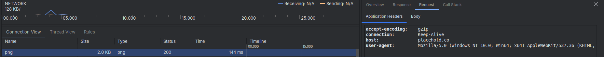

## Architecture and Design Patterns

The application is built around **Clean Architecture** principles, implemented using the **Model-View-ViewModel (MVVM)** presentation pattern.

* **Presentation Layer (UI/ViewModel):** Handled by **Jetpack Compose** and **ViewModel** with **Hilt** integration. The `AlbumsViewModel` exposes a single source of truth via a **`StateFlow`** (`AlbumsUiState`) to manage loading, content display, and error states.
* **Domain Layer (Use Cases):** Contains the core business logic, such as `FetchAlbumListUseCase`, `IsOnlineUseCase`, and `IsDatabasePopulatedUseCase`. These orchestrate data flow between the presentation and data layers.
* **Data Layer (Repositories/Sources):** Manages data access, abstracting local data sources (**Room/Paging**) and remote data sources (**Retrofit**). This includes `AlbumRemoteRepository` and `AlbumLocalRepository`.

---

### Justification of Key Technical Choices

The architectural and library choices prioritize scalability, testability, offline resilience, and modern Android development standards.

#### 1. Architecture, State, and Lifecycle (Addressing Configuration Changes)

| Choice | Justification |
| :--- | :--- |
| **Clean Architecture** | Provides a rigid **separation of concerns** (UI, Business Logic, Data). This makes the application highly **testable** and maintainable. |
| **MVVM** | Chosen for Jetpack Compose integration. The **ViewModel** holds and manages the UI state (`AlbumsUiState`) and handles lifecycle concerns. |
| **Configuration Change Handling** | The use of the **Android ViewModel** ensures that the entire application state survives configuration changes (like screen rotation). The UI is efficiently re-rendered via **Jetpack Compose** without requiring data re-fetching, directly satisfying the non-rejection criterion for handling configuration changes. |
| **Kotlin Coroutines and Flow** | Used extensively throughout all layers for **asynchronous operations** and real-time state management. `StateFlow` is the backbone of the UI state. |

#### 2. Data Persistence and Efficiency (Offline Requirement & Performance)

| Choice | Justification |
| :--- | :--- |
| **Room** | Selected for its native Android support and full compatibility with Kotlin Coroutines and Jetpack Paging. It serves as the **Single Source of Truth** for the album data, fulfilling the persistence requirement. |
| **Jetpack Paging 3** | Critical for **performance** and efficient memory usage. It loads data incrementally, ensuring a smooth scrolling experience with large datasets. |
| **RemoteMediator** | The standard pattern for handling network-bound data. It combines Paging and Room to intelligently fetch and persist data, guaranteeing **offline access** to all previously fetched data. |

#### 3. Frameworks and Libraries (Addressing Libraries and Tests)

| Library | Function | Justification |
| :--- | :--- | :--- |
| **Jetpack Compose** | UI Toolkit | Chosen as the modern, declarative UI framework, significantly reducing boilerplate and improving developer velocity. |
| **Hilt (Dagger)** | Dependency Injection | Provides a standardized, stable, and compile-time safe dependency graph for managing dependencies (e.g., ViewModels, Repositories) efficiently. |
| **Retrofit** | Networking | A robust, type-safe HTTP client for API declaration and flawless integration with Coroutines. |
| **Coil** | Image Loading | A modern, fast, and lightweight image loading library for Kotlin, specifically chosen for its native ability to customize the underlying **OkHttpClient**. |
| **JUnit, MockK, Turbine** | Testing | A comprehensive set of tools ensuring high **test coverage** and reliability of all business logic, fulfilling the non-rejection criterion for Unit Tests. |

---

### Image Retrieval Constraint

The requirement stipulates that a specific `User-Agent` header must be added to all requests aimed at retrieving an image.

This constraint is handled within the **`ImageLoaderModule`** (see `Albumlist/app/src/main/java/com/samir/albumlist/di/ImageLoaderModule.kt`). By customizing the `OkHttpClient` instance passed to Coil's `ImageLoader`, a permanent interceptor is injected to add the required header to all image requests.

**Proof of Implementation**

The following screenshot from the network monitor confirms that the **User-Agent** header is correctly being sent with the image requests:

